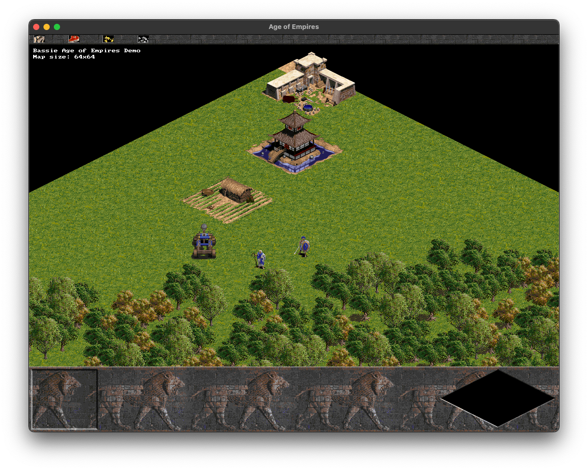
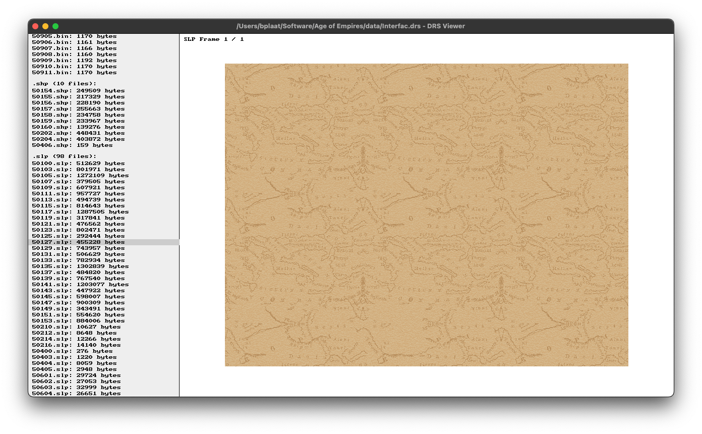

# bplaat/empires
A demo and some tools to view game data of Age of Empires I made in C11 with SDL2

This repo now contains a Age of Empires I game like render demo and a tool to inspect and browse trough DRS files (Genie Engine container file which contains all the real game data files).

## Screenshots

*A screenshot of the Age of Empires demo (nothing is working just some rendering so far!)*

*A screenshot of a little tool to inspect DRS files which contain all the game data*
